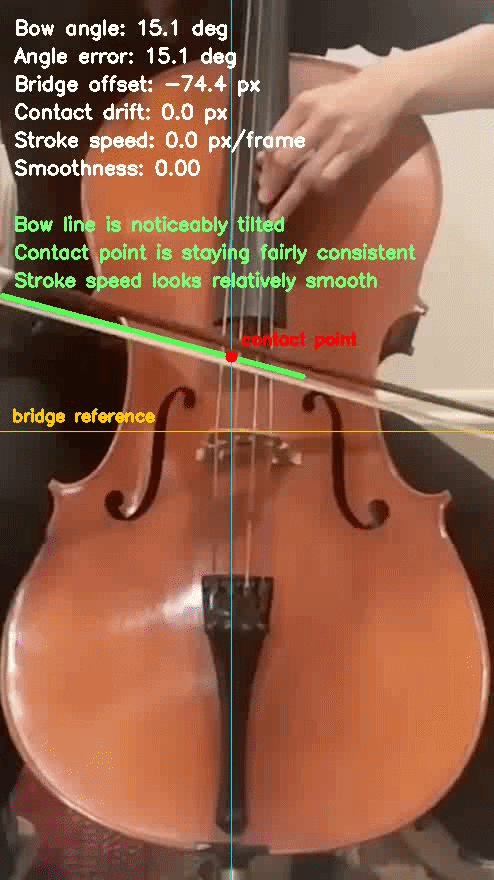
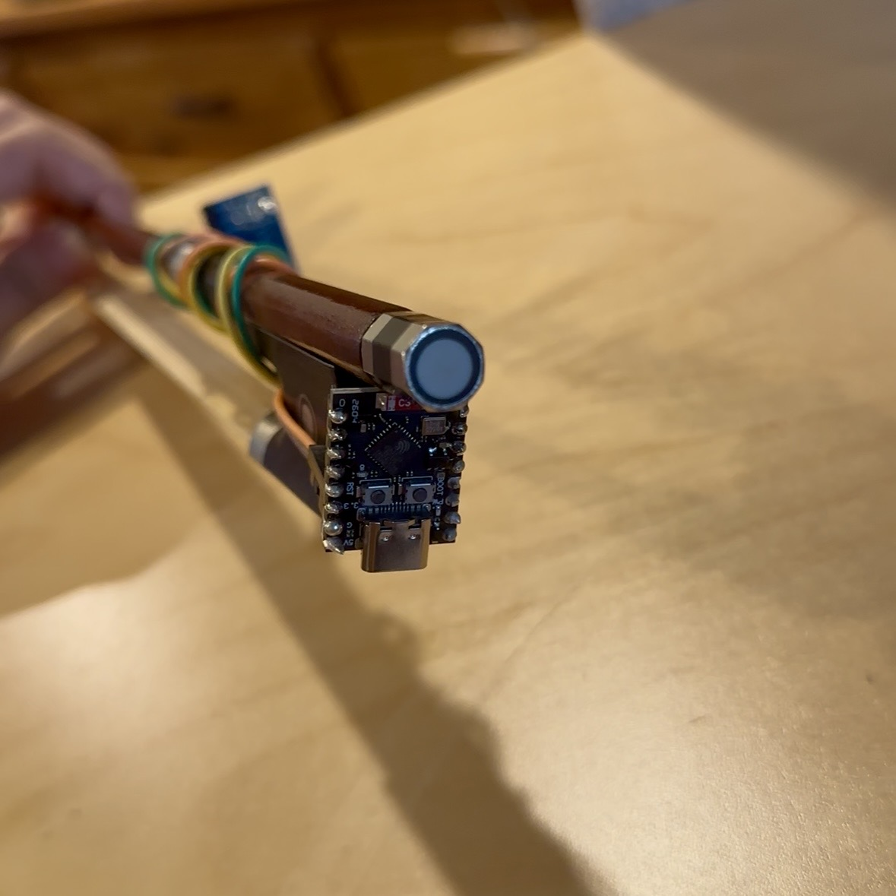
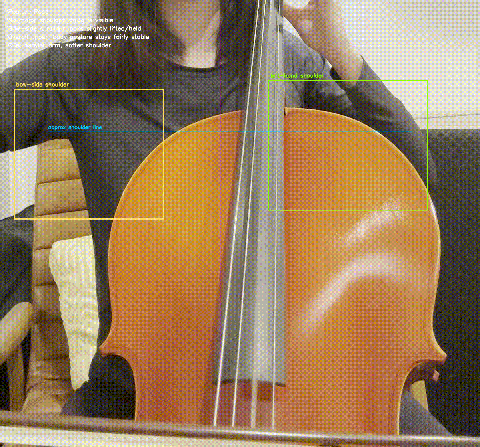
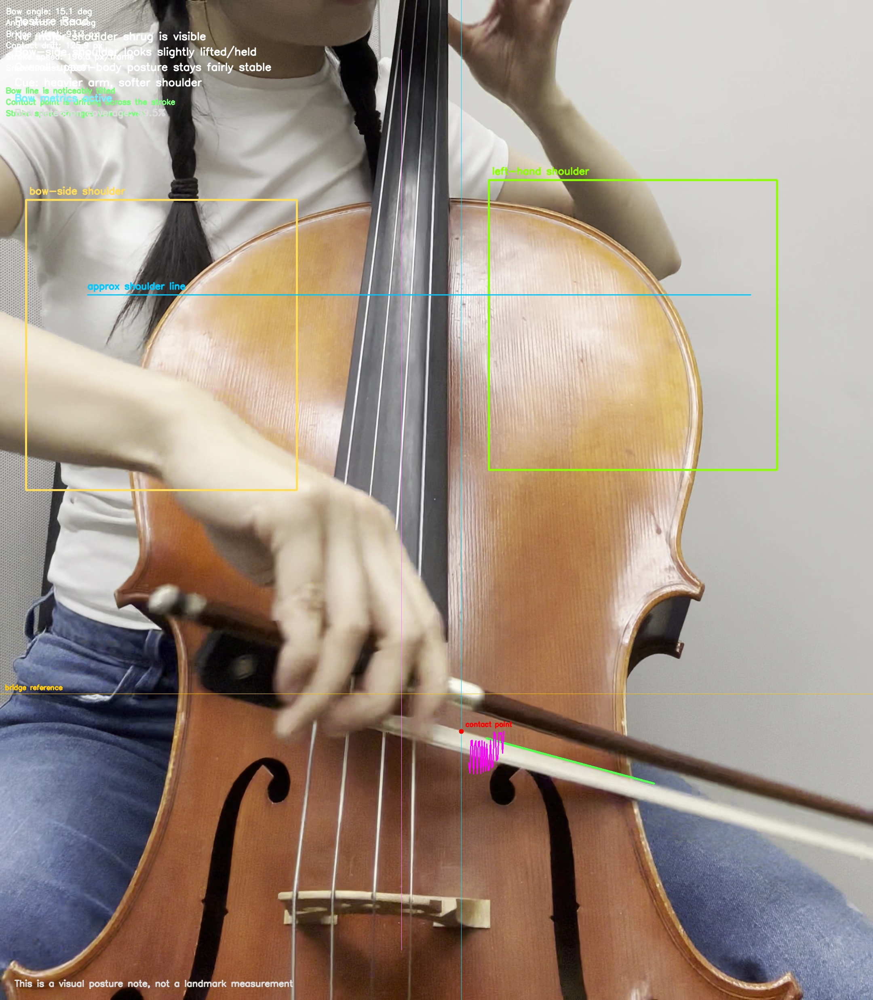
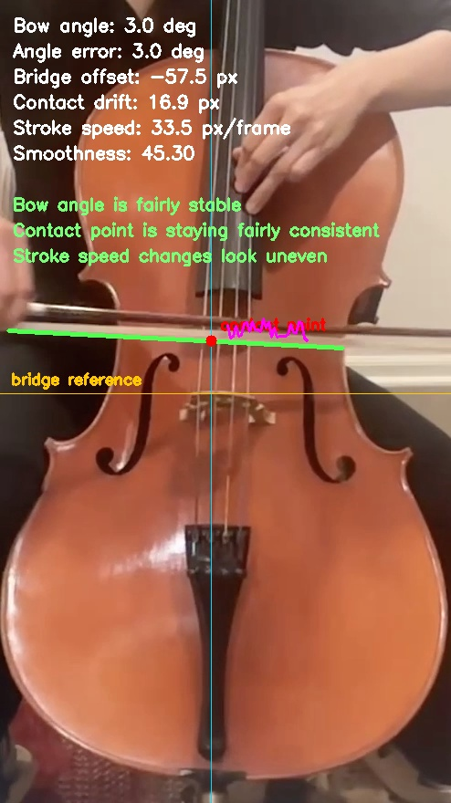

# Cello Bow Motion Tracker

`OpenCV` · `MediaPipe` · `Pose Tracking` · `Bow Tracking` · `Technique Feedback` · `Computer Vision` · `Python`

A computer vision project for analyzing cello bowing motion, posture, and early technique signals using OpenCV, MediaPipe, and Python.



Early IMU + ESP32 hardware prototype:




## Why this project matters

Beginner and intermediate string players often raise the bow-side shoulder, stiffen the wrist, or let the bow drift away from a straight stroke without realizing it. This project turns those issues into measurable motion metrics and visual feedback.

The result is more than a webcam demo:

- computer vision for human movement tracking
- geometry-based technique metrics
- musician-focused feedback loops
- a clean path to real-time or embedded deployment
- an optional IMU extension path for sensor fusion

## Features in this first version

- tracks right shoulder, elbow, and wrist with MediaPipe Pose
- estimates bow-arm angle from elbow to wrist
- records wrist path over time
- measures shoulder elevation relative to a neutral baseline
- estimates wrist smoothness from motion velocity changes
- overlays live technique feedback on video
- supports webcam or video-file input
- optionally saves an annotated output video
- includes a single clip-analysis tool for bow, posture, or combined feedback

## Planned next steps

- detect the bow itself with Hough line detection
- estimate bow straightness across each stroke
- approximate bow distance from the bridge
- add posture or technique scoring
- compare a student recording against a reference performance
- optionally deploy on Jetson with low-latency camera capture
- add an ESP32 + IMU hardware path for orientation and smoothness sensing

## Project structure

```text
cello-bow-motion-tracker/
├── README.md
├── requirements.txt
├── platformio.ini
├── data/
│   └── .gitkeep
├── demo/
│   └── .gitkeep
├── docs/
│   ├── assets/
│       ├── bow_metrics_sample.jpg
│       ├── combined_sample.jpg
│       ├── posture_fallback_demo.gif
│       ├── posture_sample.jpg
│       ├── prototype side.jpeg
│       └── prototype_back.jpeg
│   ├── esp32_gy85_accel_logger.ino
│   └── imu_esp32_extension.md
├── results/
│   └── .gitkeep
└── src/
    ├── clip_analyzer.py
    ├── bowtracker_desktop.py
    ├── main.cpp
    ├── main.py
    ├── bow_detector.py
    ├── metrics.py
    ├── pose_tracker.py
    └── visualize.py
```

## Installation

```bash
python3 -m venv .venv
source .venv/bin/activate
pip install -r requirements.txt
```

Desktop GUI setup on macOS:

```bash
python3.12 -m venv .venv312_gui
source .venv312_gui/bin/activate
pip install PySide6 pyqtgraph pyserial numpy PyOpenGL PyOpenGL_accelerate
python3 src/bowtracker_desktop.py
```

## Firmware setup

The optional IMU hardware path is set up for PlatformIO. The repository uses:

- `src/main.py` for the Python camera tracker
- `src/main.cpp` for the ESP32 firmware logger

The checked-in PlatformIO configuration is [platformio.ini](platformio.ini).

## Python compatibility

This prototype currently targets the classic MediaPipe `solutions` API. In practice, that means Python `3.10` to `3.12` is the safest choice for local development right now.

On Python `3.14`, `pip install mediapipe` currently provides the newer Tasks-oriented package layout in this environment, which does not expose `mediapipe.solutions` and will prevent the tracker from starting.

For the desktop IMU viewer on macOS, `Python 3.12` is also the recommended choice because the `PySide6` GUI stack is more reliable there than on `Python 3.14`.

## Usage

Run on a sample video:

```bash
python3 src/clip_analyzer.py --input path/to/clip.mp4 --out-dir results/clip_run
```

Run on a webcam:

```bash
python3 src/main.py --camera 0
```

Hide the preview window but still save output:

```bash
python3 src/main.py --input data/sample_video.mp4 --output results/output_demo.mp4 --no-display
```

Force a specific analysis mode:

```bash
python3 src/clip_analyzer.py --input path/to/clip.mp4 --out-dir results/clip_run --mode combined
```

## Optional IMU extension

The core repository is intentionally camera-first and works without any specialized hardware. A natural next step is an optional bow-mounted IMU path using an `ESP32-C3 SuperMini` and a small inertial sensor so the project can combine:

- bow angle and bridge offset from video
- shoulder/posture fallback from video
- bow roll and angular velocity from the IMU
- motion smoothness or jerk signals from the IMU

For the current hardware plan, recommended sensors, starter wiring, serial data format, and development notes, see [docs/imu_esp32_extension.md](docs/imu_esp32_extension.md). The current ADXL345 logger sketch is checked in at [docs/esp32_gy85_accel_logger.ino](docs/esp32_gy85_accel_logger.ino), and the matching desktop serial viewer lives at [src/bowtracker_desktop.py](src/bowtracker_desktop.py).

For PlatformIO users, the firmware entry point is [src/main.cpp](src/main.cpp).

The current desktop IMU viewer provides a live 3D acceleration-space visualization. In other words, it shows the changing `ax`, `ay`, and `az` vector in 3D, which is useful for motion intensity and directional changes. It is not yet a full reconstructed 3D bow-position tracker.

## Current prototype hardware

| Component | Notes | Approx. price | Source |
|---|---|---:|---|
| `GY-85 BMP085 Sensor Modules 9 Axis Sensor Module (ITG3205 + ADXL345 + HMC5883L), 6DOF/9DOF IMU Sensor` | Bow-mounted IMU, requires soldering | `$4.38` | [AliExpress](https://www.aliexpress.us/item/3256803649766316.html?spm=a2g0o.order_list.order_list_main.22.51f618027m97bX&gatewayAdapt=glo2usa) |
| `2pcs ESP32C3 Supermini Development Board` | Microcontroller board, requires soldering | `$5.49` for two pieces | [Temu](https://www.temu.com/goods.html?_bg_fs=1&goods_id=606169150155587&parent_order_sn=PO-211-06234479867513254&_oak_order_sn=211-06234534917753254&_oak_goods_num=1&sku_id=88630542522956&_x_sessn_id=4sl5sdt1i6&refer_page_name=bgt_order_detail&refer_page_id=10045_1780840080033_b6qkacfibg&refer_page_sn=10045) |
| `WEP 926LED V3 Soldering Station 130W MAX Soldering Iron Kit` | Includes solder wire, 5 tips, tweezers, solder sucker, tip cleaner, temperature control, sleep mode, and C/F conversion | `$29.99` | [Amazon](https://www.amazon.com/dp/B0BX2N258S?ref_=ppx_hzsearch_conn_dt_b_fed_asin_title_3) |

## Example outputs

The repository includes lightweight sample frames that show how the analyzer adapts to different camera angles and visible technique cues.

- `docs/assets/bow_metrics_sample.jpg`: bow-angle, bridge-offset, contact-point, and smoothness overlay
- `docs/assets/posture_fallback_demo.gif`: automatic posture fallback when bow tracking is unreliable
- `docs/assets/combined_sample.jpg`: combined posture + bow analysis

## Metrics in this version

### Shoulder elevation

In clips where the shoulder region is visible, the sample analyzer can switch into a posture-focused overlay and flag visible bow-side shoulder tension cues. Right now this is a visual coaching layer rather than a full landmark-based measurement.

If the clip does not support confident bow tracking, the analyzer automatically falls back to shoulder/posture-only feedback instead of forcing noisy bow metrics.

Conceptually, shoulder elevation is the vertical rise of the shoulder above a relaxed baseline:

```text
shoulder_elevation = baseline_shoulder_y - current_shoulder_y
```

If a pose-based version is available, the logic is as simple as:

```python
if shoulder_baseline_y is None:
    shoulder_baseline_y = shoulder.y

shoulder_elevation = max(0.0, shoulder_baseline_y - shoulder.y)
```



### Bow-arm angle

For bow-visible clips, the analyzer estimates bow angle from the detected bow line and reports how far it drifts from a flatter stroke.

For a line segment from `(x1, y1)` to `(x2, y2)`, the bow angle is:

```text
theta = atan2(y2 - y1, x2 - x1)
```

In code:

```python
import math

angle_deg = math.degrees(math.atan2(y2 - y1, x2 - x1))
angle_error_deg = abs(((angle_deg + 90.0) % 180.0) - 90.0)
```

That `angle_error_deg` term is the absolute deviation from a flatter reference direction.



### Wrist path

The current bow-analysis demo uses a contact-point trail at the strings, which plays a similar role: it makes drift, stroke direction, and consistency easier to see frame to frame.

The contact point is estimated by intersecting the detected bow line with the string-center reference:

```text
t = (string_center_x - x1) / (x2 - x1)
contact_y = y1 + t * (y2 - y1)
```

Then drift is measured relative to the first stable contact point:

```python
if contact_baseline_y is None:
    contact_baseline_y = contact_y

contact_drift = contact_y - contact_baseline_y
```



### Motion smoothness

Motion smoothness is estimated from stroke-speed changes over time. Large fluctuations show up as uneven bow motion, while steadier values suggest a smoother stroke.

The demo approximates per-frame stroke speed from midpoint motion:

```text
speed_t = distance(midpoint_t, midpoint_t-1)
```

Then smoothness is estimated from the variation in speed changes:

```python
import numpy as np

speed_history.append(speed_t)
smoothness = float(np.std(np.diff(np.array(speed_history, dtype=np.float32))))
```

Lower smoothness values mean a steadier stroke. Higher values suggest jerkier motion.

## Research context

This project is informed by prior work on string-performance sensing, gesture learning, and musician-centered interface design.

Most of the directly relevant literature here is focused on violin rather than cello, so this project treats those studies as strong starting points rather than one-to-one validation for cello technique analysis.

- Dalmazzo, Tassani, and Ramírez recorded a professional violinist performing four core bowing techniques: détaché, martelé, spiccato, and ricochet. They compared a high-precision MOCAP setup against a low-cost Myo armband and reported that the Myo-based J48 classifier slightly outperformed the MOCAP-based one (`99.8473%` vs `99.4622%` correctly classified instances). For this repository, that is an important result: useful technique-feedback systems do not necessarily need expensive capture hardware if the extracted features are discriminative enough. Source: [A Machine Learning Approach to Violin Bow Technique Classification: a Comparison Between IMU and MOCAP systems](https://doi.org/10.1145/3266157.3266216).
- Alonso Trillo, Nelson, and Michailidis argue that interface design is a major bottleneck in real-world bow-tracking systems: a device may produce useful data, but still fail if it is bulky, changes the balance of the bow, or forces retraining. Their MetaBow work is especially relevant here because it focuses on preserving traditional bow mechanics, minimizing disruption to prelearned movement patterns, and keeping the sensing workflow player-oriented. They also frame a concrete measurement space around bow speed, bow tilt, bow location, bow force, bow-bridge distance, inclination, and finger pressure. That directly supports the direction of this project: use video first for nonintrusive feedback, then test whether the extracted metrics are useful before adding any specialized hardware. Source: [Rethinking Instrumental Interface Design: The MetaBow](https://direct.mit.edu/comj/article/47/2/5/122626/Rethinking-Instrumental-Interface-Design-The).

## What to test next

Based on those papers, and keeping in mind that they mostly study violin rather than cello, the next useful experiments for this repository are:

- Build a labeled bowing dataset around the four techniques emphasized by Dalmazzo et al.: détaché, martelé, spiccato, and ricochet.
- Train a lightweight classifier on video-derived features such as bow angle, bridge offset, contact-point drift, and motion smoothness, then compare how well those features separate the four bow strokes.
- Add repeatability tests: record multiple takes of the same articulation and measure whether the extracted metrics stay stable enough to support real feedback rather than one-off visualization.
- Test “good-practice reference” feedback by comparing a student take against an expert reference clip, following the TELMI-style self-learning idea in the Dalmazzo et al. paper.
- Expand the metric set toward the MetaBow parameter space: bow speed, bow tilt, bow-bridge distance, bow-force proxies, and finger-pressure proxies where possible.
- Run camera-placement experiments to determine which viewpoints best recover those parameters from vision alone: front, front-right, and side views are the most obvious first candidates.
- Validate the interface design itself, not just the tracking accuracy: check whether the feedback remains nonintrusive, easy to understand, and usable during normal practice without forcing the player to adapt to the tool.
- If single-camera vision reaches its limit, add optional sensor fusion rather than making hardware mandatory, keeping the core workflow low-cost and player-friendly.
- Prototype a lightweight sensor-fusion version with an `ESP32-C3` and a bow-mounted IMU, but keep that hardware path optional so the base workflow remains camera-only and easy to adopt.
